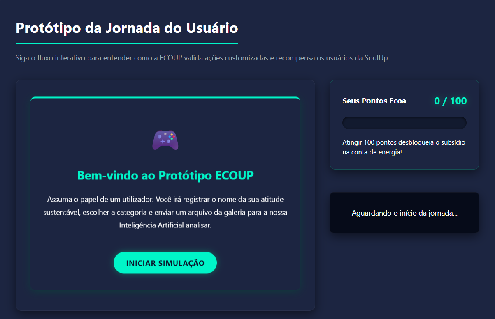
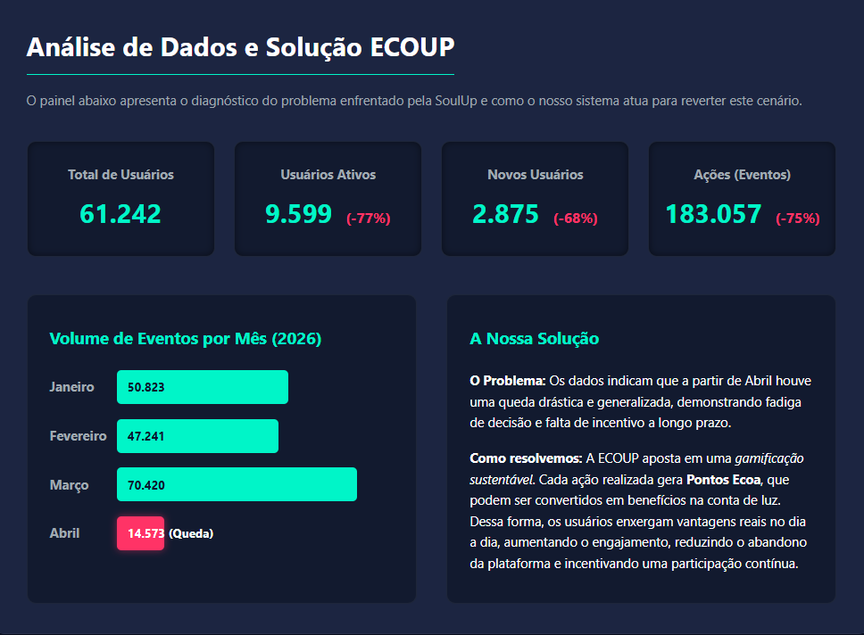
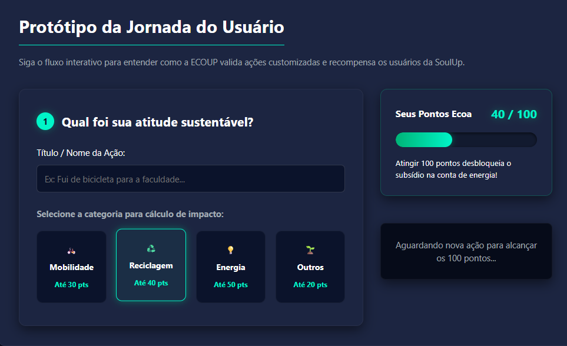

# 🌿 ECOUP - Sistema de Gamificação Sustentável para SoulUp

## 📖 Título e Descrição do Projeto
**ECOUP Gamification System**: Uma solução digital desenvolvida pela startup ECOUP para a plataforma SoulUp. O projeto consiste num módulo web responsivo focado em avaliar, pontuar e incentivar ações sustentáveis realizadas pelos utilizadores. O sistema visa reverter quedas de engajamento através da gamificação baseada em "Pontos Ecoa", promovendo recompensas reais como subsídios na conta de luz.

## 🚀 Link do Repositório
Acesso público ao código-fonte do projeto no GitHub:
[Acessar o repositório ECOUP - SoulUp Gamificação](https://github.com/nicolaspk/ecoup-gamificacao.git)

## 📸 Imagens e Representação do Projeto
Abaixo encontram-se as principais interfaces do sistema que demonstram o seu funcionamento visual e interativo:
* 
* 
* 

## 🛠️ Tecnologias Utilizadas
O projeto foi integralmente construído utilizando tecnologias nativas, sem dependência de bibliotecas externas:
* **HTML5:** Estruturação semântica, organização de conteúdo e formulários acessíveis (com validação via ARIA labels).
* **CSS3:** Estilização modular com CSS Grid e Flexbox, Media Queries para adaptação responsiva (Mobile, Tablet, Desktop) e interface em *Dark Theme UI*.
* **JavaScript:** Manipulação dinâmica do DOM, tratamento de eventos interativos e persistência de dados de simulação utilizando a *Web Storage API* (`LocalStorage` e `SessionStorage`).

## 📂 Estrutura de Pastas
O projeto segue uma arquitetura limpa e organizada na raiz:

/css       -> Arquivo de estilização principal (style.css)
/img       -> Imagens, fotos dos integrantes e ícones
/js        -> Lógica de interatividade, eventos e LocalStorage (main.js)
/paginas   -> Arquivos HTML secundários (contato.html, dashboard.html, faq.html, integrantes.html, simulador.html, sobre.html)
index.html -> Página inicial na raiz do projeto
README.md  -> Guia técnico e documentação do projeto

## 👥 Autores e Créditos (Equipe ECOUP)
* **Maria Eduarda Escandor** (RM: 568216) - Turma: 1TDSPO - [LinkedIn](https://www.linkedin.com/in/maria-eduarda-escandor-5b1587359/) | [GitHub](https://github.com/mariabatistaescandor-gif)
* **Erick Menezes** (RM: 570325) - Turma: 1TDSPF - [LinkedIn](https://www.linkedin.com/in/erick-menezes-b53009232/) | [GitHub](https://github.com/Erick488-maker)
* **Katerine Hildebrand** (RM: 569809) - Turma: 1TDSPF - [LinkedIn](https://www.linkedin.com/in/katerine-hildebrand-8928752a3/) | [GitHub](https://github.com/katpeaga)
* **Maria Eduarda Lopes de Lima** (RM: 572425) - Turma: 1TDSPO - [LinkedIn](https://www.linkedin.com/in/maria-eduarda-lopes-de-lima-1291b6289/) | [GitHub](https://github.com/mariaeduardaalima)
* **Nicolas Sousa** (RM: 574141) - Turma: 1TDSPH - [LinkedIn](https://www.linkedin.com/in/nicolas-sousaa/) | [GitHub](https://github.com/nicolaspk)

## 📧 Contato
Para suporte ou dúvidas comerciais: materiafiap@gmail.com